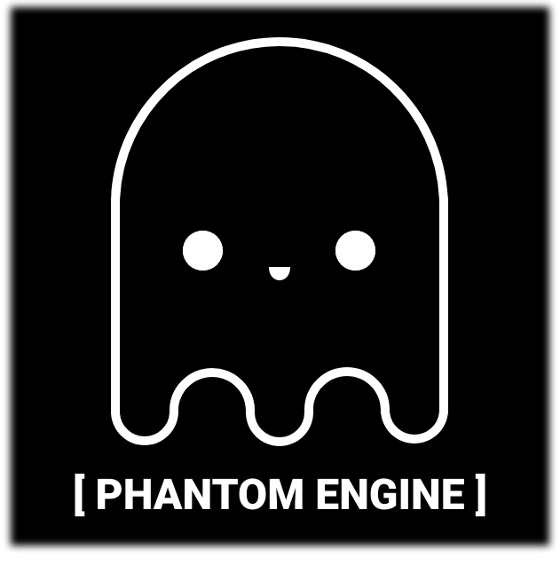

&nbsp;&nbsp;&nbsp;&nbsp;&nbsp;&nbsp;&nbsp;&nbsp;&nbsp;&nbsp;&nbsp;&nbsp;&nbsp;&nbsp;&nbsp;&nbsp;&nbsp;&nbsp;&nbsp;

  
  
  
  
  

 NOTICE: The build status badge on the right may say build failed, that is due to still learning how to build github action workflows.

## Introduction
The Phantom Engine is a game engine aimed at making retro aesthetic games. Currently it's being developed along side [Fear The Crow](https://github.com/ionthedev/Fear-the-Crow), a quake styled shooter game.
Currently it does not have a GUI and won't have one for a long time. So in it's current state, it is a code only project.

The project originally began using Raylib and ImGui as it's base, however for what the project is currently needing, I feel stepping away from that framework to 
something that caters to the necessities of the project.

## Libraries
Currently we are only using the following
- [SDL](https://github.com/libsdl-org/SDL) Multimedia Layer
- [Bullet3](https://github.com/bulletphysics/bullet3/) Physics and Collisions
- [ImGui Docking](https://github.com/ocornut/imgui/tree/docking) Graphical User Interface
- [glad](https://github.com/Dav1dde/glad) Rendering Loader-Generator
- [gl2d](https://github.com/meemknight/gl2d) 2D Library made in OpenGL
- [glm](https://github.com/g-truc/glm) OpenGL Mathematics 
- [stb image and typeface](https://github.com/nothings/stb) 
- [enet](https://github.com/zpl-c/enet/) Included but not implemented
## How to Install
The setup for the engine is the same as Raylib's setup.

- Windows: https://github.com/raysan5/raylib/wiki/Working-on-Windows
- Linux: https://github.com/raysan5/raylib/wiki/Working-on-GNU-Linux
- MacOS: https://github.com/raysan5/raylib/wiki/Working-on-macOS
